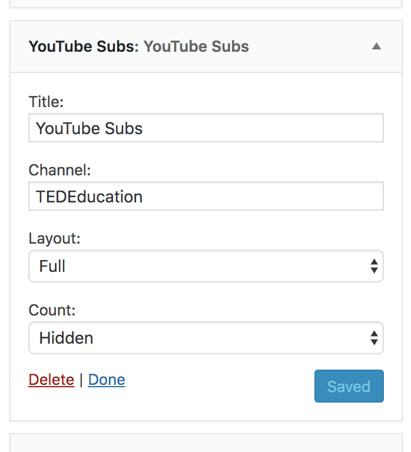
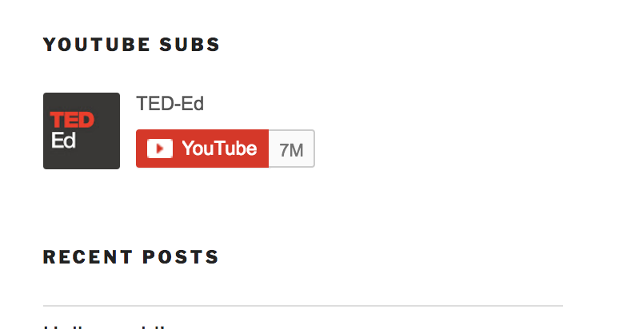
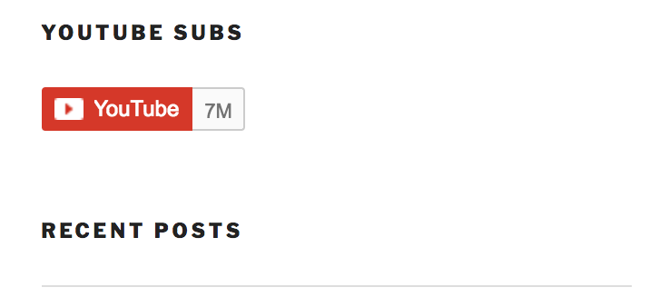

# Welcome
This is a Wordpress plugin built with PHP, Wordpress, and the YouTube API.

# How to Use
Copy the "youtubesubs" folder into your plugins Wordpress folder and launch your admin site.

# The How & What
This widget displays the YouTube channel subscription box of your choice on your Wordpress powered site via a widget. The widget has the option of displaying any YouTube channel you select, two view options (Full or Default), and whether or not the subscription count for that channel is displayed. 

# Screenshots

When you activate the widget, the widget options appear as below:

You can choose a "Full" display view with the subscription count:

Or the "Default" display view with the subscription count: 

Or, you can get rid of the count altogether:

# Thank You
Enjoy! :) 